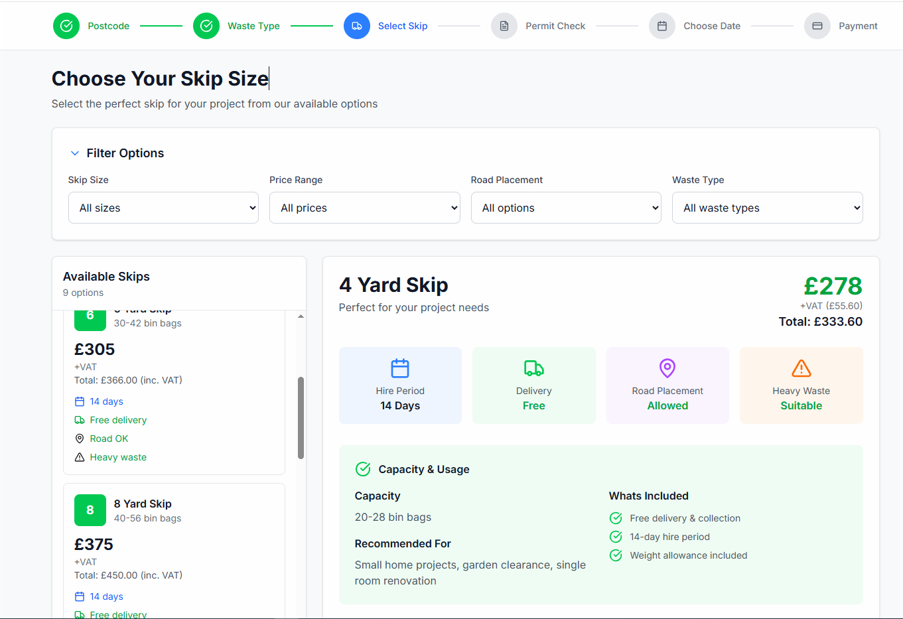
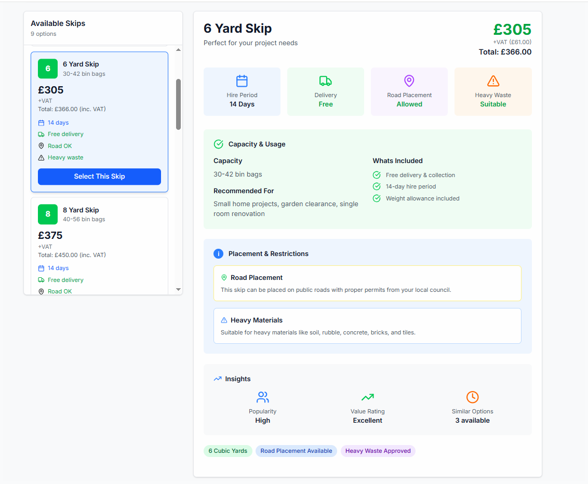
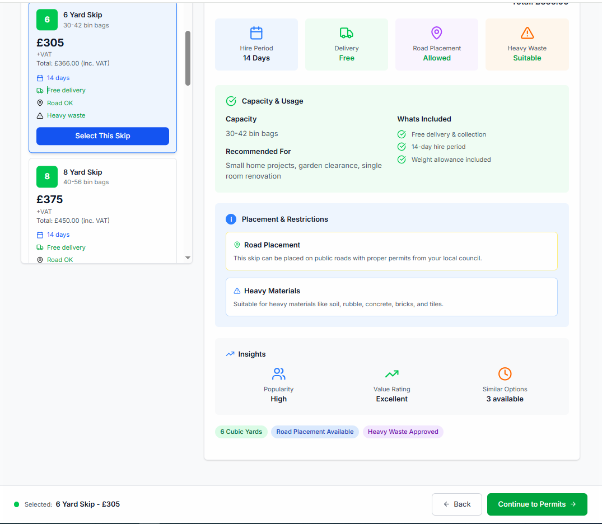

# SKIP-HIRE-APP

## Project Overview
This project is a redesigned version of the "Choose Your Skip Size" page from https://wewantwaste.co.uk/, developed as part of a React coding challenge. The goal was to create a completely different UI while maintaining the original functionality, focusing on clean, maintainable code, responsiveness, and improved UI/UX. The redesign includes a modern stepper navigation, interactive skip cards, detailed skip information, and a filter section, optimized for both mobile and desktop browsers.

## Approach
### Technology Stack
- **React**: Used for building the front-end with a component-based architecture.
- **Next.js**: Leveraged for server-side rendering and static site generation.
- **Tailwind CSS**: Applied for rapid UI development with a utility-first approach.
- **Lucide React**: Utilized for icons to enhance visual feedback.
- **TypeScript**: Employed for type safety and better code maintainability.

### Design Decisions
- **Stepper Component**: Added a horizontal stepper to guide users through the process, with visual indicators for completed and current steps.
- **Responsive Layout**: Implemented a flexible grid system to ensure the interface adapts seamlessly to mobile and desktop screens.
- **Filter Section**: Introduced a filter panel with dropdowns for skip size, price range, road placement, and waste type to enhance user control.
- **Skip Cards**: Designed interactive cards for skip selection with hover effects and a selected state indicator.
- **Skip Details**: Created a detailed view with categorized sections (e.g., capacity, placement) using cards and icons for better readability.

### Data Integration
- Fetched skip data from https://app.wewantwaste.co.uk/api/skips/by-location?postcode=NR32&area=Lowestoft to populate the skip options dynamically.
- Used a custom hook (`useSkipFilter`) to manage filtering logic based on user selections.

### Code Structure
- Organized components in the `src/components` directory (e.g., `Stepper`, `FilterSection`, `SkipCard`, `SkipDetails`, `Footer`).
- Defined types in `src/types/skip.ts` for type safety.
- Managed global styles in `src/globals.css` with Tailwind CSS configuration.

### UI/UX Improvements
- Enhanced visual hierarchy with color-coded sections and icons.
- Added tooltips and detailed insights (e.g., popularity, value rating) to inform user decisions.
- Ensured accessibility with proper contrast and focus states.

## Installation
1. Clone the repository: `git clone https://github.com/MainaMwangiy/skip-hire-app`
2. Navigate to the project directory: `cd SKIP-HIRE-APP`
3. Install dependencies: `npm install` or `yarn install`
4. Run the development server: `npm run dev` or `yarn dev`
5. Open http://localhost:3000 to view the app.

## Usage
- Use the filter options to narrow down skip choices.
- Click a skip card to view detailed information and select it.
- Navigate using the back and continue buttons in the footer.

## Screenshots
- **Stepper and Filter Section**: 
- **Skip Cards and Details**: 
- **Footer**: 

## Submission
- **GitHub Repository**: [GitHub Link](https://github.com/MainaMwangiy/skip-hire-app)
- **Sandbox Link**: [SandBox Link](https://codesandbox.io/p/github/MainaMwangiy/skip-hire-app/master)
- Submitted via https://forms.gle/N6nKLgW8CMqZ2eFY8 within 72 hours.

## Questions
Feel free to reach out with any questions!